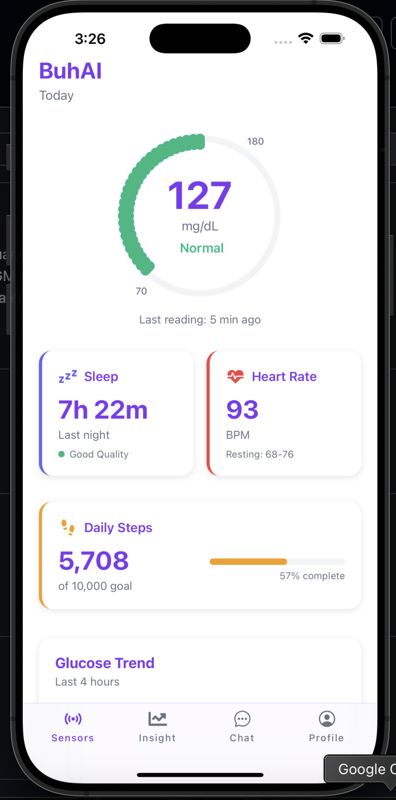
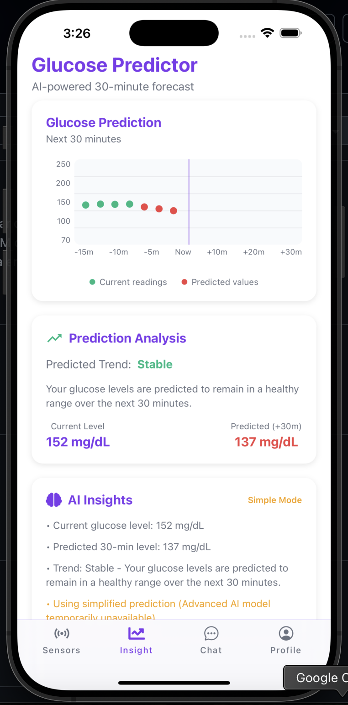
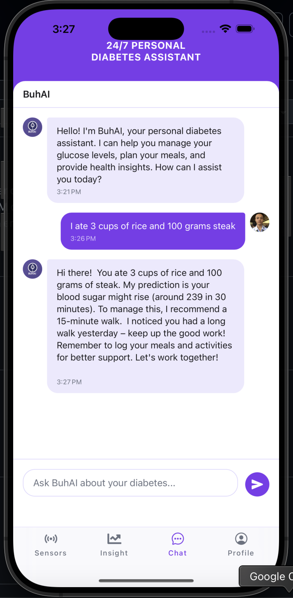

# BuhAI: Personalized Diabetes Assistant

BuhAI is a comprehensive diabetes management application that combines a modern React Native frontend with a powerful AI-powered backend. The app helps users manage diabetes through personalized, real-time insights using Continuous Glucose Monitor (CGM) data, advanced LSTM machine learning models, and an intelligent chat assistant that provides 24/7 support for diabetes management.

## Key Features

- **24/7 Personal Diabetes Assistant**: AI-powered chat interface for real-time diabetes management
- **LSTM Glucose Prediction**: Advanced machine learning models predicting glucose levels 30 and 60 minutes ahead
- **Predictive Insights**: Advanced RAG (Retrieval-Augmented Generation) system for personalized recommendations
- **English Language Support**: User-friendly interface with clear, supportive English communication
- **Real-time Glucose Monitoring**: Integration with CGM data for accurate predictions
- **Smart Alerts**: Proactive warnings for hypoglycemia and hyperglycemia events
- **Progress Tracking**: Daily summaries and trend analysis
- **Multi-platform**: Built with Expo for iOS, Android, and web

## 📱 App Screenshots

### Real-time Health Monitoring

*The main dashboard displays real-time glucose levels, sleep quality, heart rate, and daily activity metrics with an intuitive circular glucose meter*

### AI-Powered Glucose Predictions

*Advanced LSTM models provide 30-minute glucose forecasts with trend analysis and personalized recommendations*

### Intelligent Chat Assistant

*24/7 AI assistant provides personalized diabetes advice, meal logging, and health insights in natural English*

## Architecture

The app consists of two main components:

### Frontend (React Native/Expo)
- Modern, responsive UI built with React Native
- Real-time chat interface with the AI assistant
- Cross-platform compatibility (iOS, Android, Web)
- Integrated with backend RAG system

### Backend (Python/Flask)
- **Hybrid RAG System**: Combines retrieved unstructured text with structured data
- **LSTM Prediction Models**: Multivariate time series models for glucose forecasting
- **ChromaDB Vector Store**: Fast semantic retrieval of user logs
- **SQLite Database**: Structured storage of user data and health metrics
- **Gemini AI Integration**: Natural language processing for intelligent English responses
- **RESTful API**: Clean API endpoints for frontend integration
- **Fallback System**: Graceful degradation when advanced models are unavailable

## Quick Start

### Prerequisites
- Node.js 18+ and npm
- Python 3.9+
- Google Gemini API Key
- iOS Simulator (for iOS development) or Android Studio (for Android development)

### Frontend Setup

1. **Install dependencies**
   ```bash
   npm install
   ```

2. **Set up environment variables**
   ```bash
   # Create .env file with your Gemini API key
   echo "EXPO_PUBLIC_GEMINI_API_KEY=your_api_key_here" > .env
   ```

3. **Start the development server**
   ```bash
   npx expo start
   ```

4. **Open the app**
   - Press `i` for iOS simulator
   - Press `a` for Android emulator
   - Scan QR code with Expo Go app on your device

### Backend Setup

1. **Navigate to the backend system**
   ```bash
   cd BuhAI-Backend
   ```

2. **Create virtual environment**
   ```bash
   python3 -m venv venv
   source venv/bin/activate  # On Windows: venv\Scripts\activate
   ```

3. **Install dependencies**
   ```bash
   pip install -r requirements.txt
   ```

4. **Set up environment variables**
   ```bash
   # Create .env file in BuhAI-Backend directory
   echo "GEMINI_API_KEY=your_api_key_here" > .env
   ```

5. **Initialize database and vector store**
   ```bash
   python ingest/ingest_csv.py
   ```

6. **Start the backend server**
   ```bash
   python app.py
   ```

The backend API will be available at `http://localhost:4000`

7. **Test LSTM integration** (optional)
   ```bash
   python test_lstm_integration.py
   ```

## 📱 Usage

### Chat Interface
- Open the app and navigate to the "Chat" tab
- Type questions about diabetes management in English
- Receive personalized insights based on your health data
- Get real-time glucose predictions and recommendations
- Log meals and activities for better prediction accuracy

### LSTM Prediction Features
- **30-minute predictions**: Short-term glucose forecasting for immediate decisions
- **60-minute predictions**: Extended horizon for meal and activity planning
- **Multivariate inputs**: Considers meals, activity, sleep, and time patterns
- **Real-time processing**: Instant predictions via REST API
- **Fallback system**: Simple predictions when advanced models are unavailable

### Sample Interactions
- "I just ate 3 cups of rice and 100 grams steak"
- "What's my glucose trend today?"
- "Should I exercise now?"
- "Predict my glucose in 30 minutes"
- "Can you give me a daily summary?"
- "What should I eat for my next meal?"

## API Endpoints

### Health Status
```bash
GET /api/v1/status
```

### Get Personalized Insight
```bash
POST /api/v1/insight
Content-Type: application/json

{
  "user_id": "demo_user_01",
  "event_type": "meal",
  "event_data": {
    "description": "2 cups of white rice and fried chicken"
  }
}
```

### Check Missed Meals
```bash
GET /api/v1/inactivity-check
```

### Daily Progress Report
```bash
GET /api/v1/daily-summary
```

### LSTM Glucose Prediction
```bash
POST /api/v1/predict
Content-Type: application/json

{
  "glucose_readings": [120, 125, 130, ...],
  "meal_flags": [0, 0, 1, ...],
  "activity_levels": [0, 1, 0, ...],
  "sleep_quality": 0,
  "horizon": "both"
}
```

### Prediction Health Check
```bash
GET /api/v1/predict/health
```

### Model Information
```bash
GET /api/v1/predict/info
```

### Sample Prediction Test
```bash
GET /api/v1/predict/sample
```

## Testing

For detailed API testing instructions, see [RAG-SIMPLIFIED/TESTING_README.md](RAG-SIMPLIFIED/TESTING_README.md)

## Development Workflow

1. **Reset to fresh project** (if needed)
   ```bash
   npm run reset-project
   ```

2. **Start both servers**
   ```bash
   # Terminal 1: Frontend
   npx expo start
   
   # Terminal 2: Backend
   cd BuhAI-Backend && python app.py
   ```

3. **API Configuration**
   - The app is configured to use `http://localhost:4000` for local development
   - Chat API: `http://localhost:4000/api/v1/chat`
   - LSTM API: `http://localhost:4000/api/v1/predict`
   - Update IP address in `services/api.ts` if deploying to different environment

## Documentation

- **Frontend**: Built with Expo and React Native
- **Backend**: Detailed documentation in [BuhAI-Backend/README.md](BuhAI-Backend/README.md)
- **LSTM Models**: Training and prediction details in backend documentation
- **API Testing**: Test LSTM integration with [BuhAI-Backend/test_lstm_integration.py](BuhAI-Backend/test_lstm_integration.py)
- **Routing**: App structure documented in [ROUTING_STRUCTURE.md](ROUTING_STRUCTURE.md)

## Security

- API keys are stored in environment variables
- Local database with encrypted sensitive data
- HTTPS recommended for production deployment

## Learn More

To learn more about the technologies used:

- [Expo documentation](https://docs.expo.dev/): React Native development framework
- [React Native](https://reactnative.dev/): Mobile app development
- [ChromaDB](https://docs.trychroma.com/): Vector database for RAG
- [Flask](https://flask.palletsprojects.com/): Python web framework
- [Gemini AI](https://ai.google.dev/): Google's language model

## What Makes BuhAI Special?

BuhAI stands out as a comprehensive diabetes management solution that combines:

**Advanced AI Technology**: LSTM machine learning models provide accurate glucose predictions
**Intelligent Chat Assistant**: 24/7 support with personalized diabetes advice
**Real-time Monitoring**: Live glucose tracking with trend analysis
**Fallback System**: Reliable predictions even when advanced models are unavailable
**Modern Interface**: Clean, intuitive design built with React Native
**Cross-platform**: Works on iOS, Android, and web

## Contributing

This project is designed to help diabetes patients with AI-powered health management. Whether you're a developer, healthcare professional, or someone living with diabetes, contributions are welcome!


